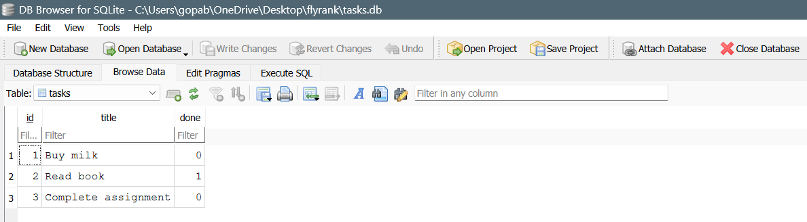

# Task API with SQLite

This is a CRUD API built with FastAPI. In this version, the in-memory array has been replaced with a real SQLite database. The API endpoints remain exactly the same, but the data now survives server restarts.

## How to Run the Project
1. Install dependencies (if not already installed): 
   pip install fastapi uvicorn
2. Run the server: 
   uvicorn main:app --reload
3. The database (`tasks.db`) and the `tasks` table will be created automatically on the first run. Three example tasks will also be seeded if the table is empty.

## Database Details
* **Why SQLite was chosen:** It is serverless, requires zero configuration, and stores the entire database in a single file on the local machine. It is perfectly lightweight for this use case and ensures our data persists across restarts.
* **Where the database file is stored:** In the root directory of the project, named `tasks.db`.

## Stage 4: Example SQL Query
I explored the database using DB Browser for SQLite. Here is one of the manual queries I executed to fetch only the completed tasks:
SELECT * FROM tasks WHERE done = 1;

## Database Screenshot
Here is a screenshot of the SQLite database opened in DB Browser:

