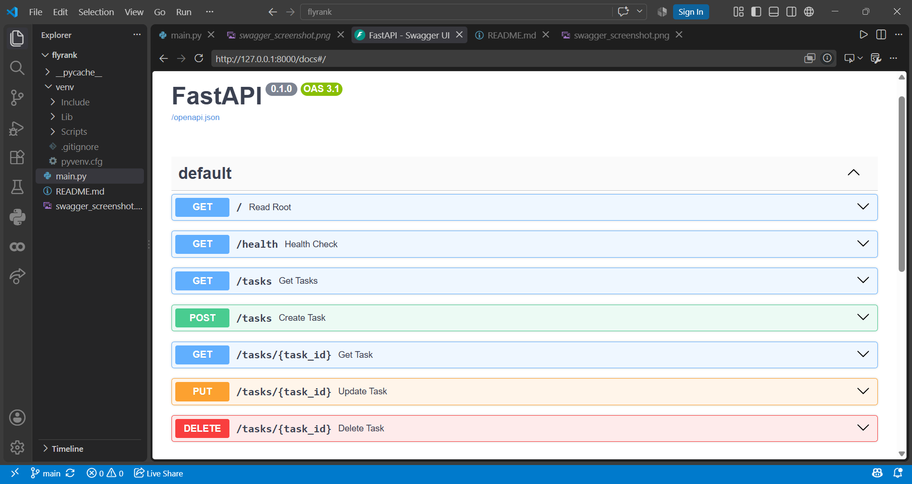

# To-Do List CRUD API

This is a small API that manages a to-do list. It allows you to create, read, update, and delete tasks using an in-memory data list. It is built using Python and FastAPI.

## How to Install & Run

Install the required dependencies and start the server with the following commands:

```bash
pip install fastapi uvicorn pydantic
uvicorn main:app --reload
```

## Endpoints

| HTTP Method | Endpoint | Description |
|---|---|---|
| GET | `/` | API Root and description |
| GET | `/health` | Server health check |
| GET | `/tasks` | List all tasks |
| POST | `/tasks` | Create a new task |
| GET | `/tasks/{id}` | Get a specific task by ID |
| PUT | `/tasks/{id}` | Update an existing task |
| DELETE | `/tasks/{id}` | Delete a task |

## Example `curl -i` Output

Command:
```bash
curl -i http://localhost:8000/tasks
```

Output:
```http
HTTP/1.1 200 OK
date: Sun, 20 Sep 2026 07:14:44 GMT
server: uvicorn
content-length: 124
content-type: application/json

[{"id":1,"title":"Buy milk","done":false},{"id":2,"title":"Read book","done":true},{"id":3,"title":"Complete assignment","done":false}]
```

## Swagger UI

Here is the interactive Swagger UI showing the full CRUD cycle:

